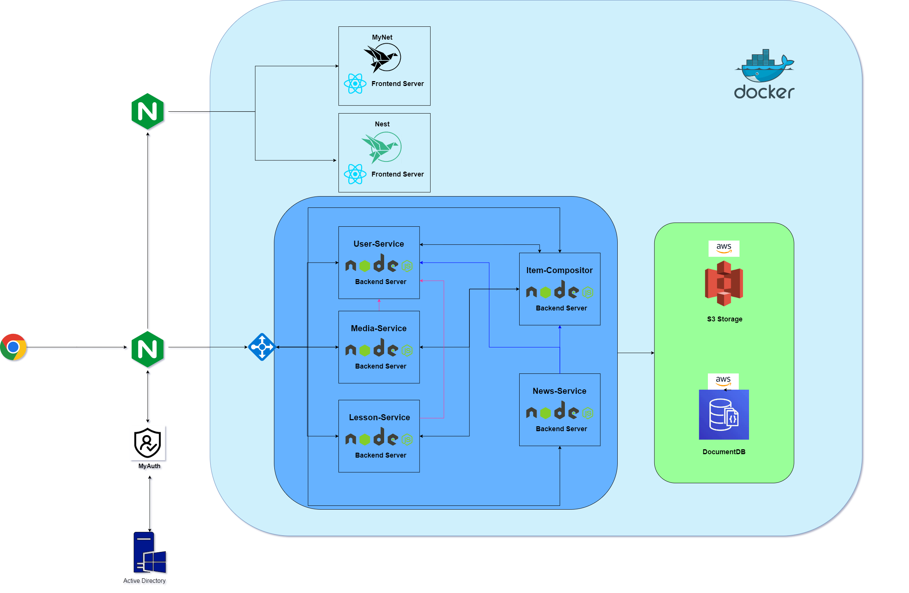

# MyNet

## Overview

myNet is a mobile web app designed as a study tool for 40,000 - 50,000 users. The app provides personalized content, a vast array of lessons, media data, and news data, all tailored based on user location. With a hierarchical structure for user authentication and authorization, team leaders can send tests to team members, assessing their learning progress. The app is built on a microservices architecture, utilizing AWS DocumentDB for database management and AWS S3 for storage.

## Features

- **Personalized Content:** Deliver tailored content to users based on their location, enhancing their learning experience.
- **Lessons, Media, and News:** Offer a vast array of lessons, media data, and news data, providing users with a comprehensive learning environment.
- **User Authentication and Authorization:** Implement a secure and hierarchical user authentication and authorization system to manage access and permissions.
- **Testing and Progress Tracking:** Enable team leaders to send tests to team members, assessing their learning progress and identifying areas for improvement.
- **Microservices Architecture:** Leverage a scalable and modular microservices architecture to ensure the app's flexibility and reliability.
- **AWS DocumentDB and S3 Integration:** Utilize AWS DocumentDB for efficient database management and AWS S3 for reliable storage solutions

## Version

The project is currently in its final development stages, with the team working on polishing features, optimizations, and addressing any remaining issues. The final version of the project will not be available to the general public.

## Architecture

## Getting Started:

### Prerequisites:

- A modern web browser (e.g., Google Chrome, Mozilla Firefox, Safari)
- Node.js and npm installed on your local machine

### Installation:

1. Clone the repository:
   git clone https://github.com/yarinhd/myNet.git
2. Navigate to the project directory and install the required dependencies:
   cd employee-management-web-project
   npm install
3. Set up the necessary environment variables in a .env file in the project's root directory, following the .env.example file as a template.
4. Start the development server:
   npm run dev

The application should now be accessible at http://localhost:3000 in your web browser.

## Contributing:

I welcome contributions from the community! To contribute, please follow these steps:

- Fork the repository
- Create a new branch with a descriptive name for your feature or bugfix
- Commit your changes to the new branch
- Submit a pull request from your forked repository to the original repository
  Please also feel free to report bugs, request new features, or provide feedback by creating an issue in the GitHub repository